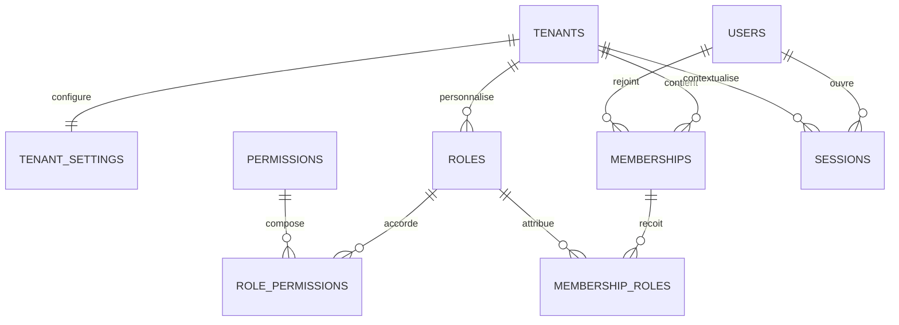
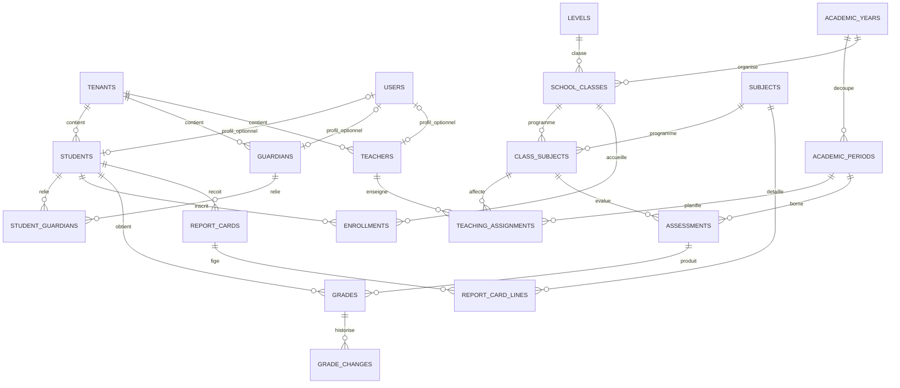
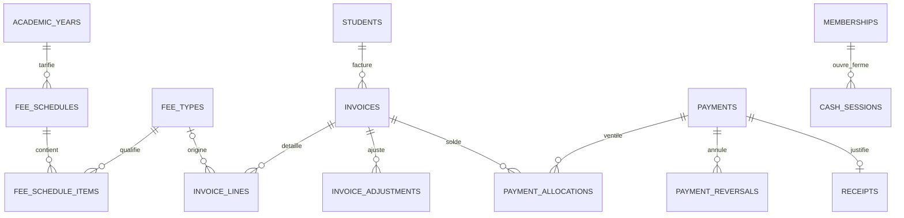
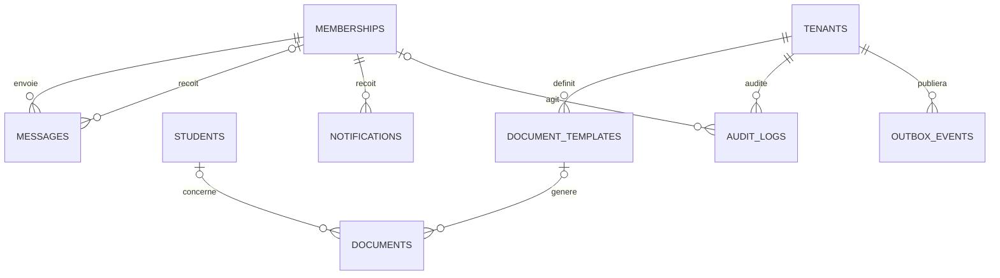

# Modèle de données — LOT 3

Ce document décrit le socle historique de 43 tables. Le LOT 4 ajoute quatre tables techniques
IAM et des champs/contraintes additifs, sans réécrire la migration initiale ; le schéma compte
désormais 47 modèles. Voir [IAM — évolution PostgreSQL](../security/iam-auth.md#audit-et-évolution-postgresql).

## Périmètre et propriété

`packages/database` est l'unique propriétaire du contrat Prisma, des migrations, du client généré,
du seed local et des tests d'intégrité. Les applications consommeront plus tard son export public ;
aucun contrat Prisma parallèle ne doit être ajouté dans `apps/*` ou un autre package.

Ce lot construit seulement le socle relationnel. Il ne fournit ni authentification, ni endpoints
métier, ni moteur d'autorisation, ni jobs BullMQ. `outbox_events` prépare un futur transport fiable
sans en implémenter le consommateur.

## Conventions physiques

- PostgreSQL 18.6 ; `prisma`, `@prisma/client` et `@prisma/adapter-pg` en version GA `7.10.0`,
  épinglés exactement ;
- modèles et champs Prisma en `PascalCase`/`camelCase`, tables et colonnes PostgreSQL en
  `snake_case` grâce à `@@map` et `@map` ;
- identifiants techniques `UUID` générés côté PostgreSQL avec `uuidv7()`, donc ordonnables dans le
  temps sans dépendre d'une horloge applicative ;
- instants en `TIMESTAMPTZ(6)` et dates civiles en `DATE` ;
- montants en unités mineures dans des `BIGINT`, accompagnés d'un code devise ISO sur trois
  majuscules ; aucun montant financier en flottant ;
- coefficients, notes et moyennes en `DECIMAL`, JSON structuré en `JSONB` ;
- `prisma/schema.prisma` est l'unique source officielle des 43 modèles ;
- `prisma/migrations/20260904000100_initial_schema/migration.sql` est la migration initiale
  officielle. Elle reste intacte et `prisma db push` n'appartient pas au workflow du projet ;
- `prisma.config.ts` relie ce schéma, le dossier de migrations, le seed et `DATABASE_URL` ;
- `src/generated/prisma/` est régénéré par `pnpm db:generate` et exclu de Git ;
- `src/client.ts` construit le client Prisma 7 avec l'adaptateur PostgreSQL officiel. Une lecture
  réelle via ce client fait partie des 18 tests d'intégrité.

## Inventaire complet — 43 tables

| Domaine                                   | Tables                                                                                                                                                                                                               |
| ----------------------------------------- | -------------------------------------------------------------------------------------------------------------------------------------------------------------------------------------------------------------------- |
| Tenant, accès et sessions (9)             | `tenants`, `tenant_settings`, `users`, `memberships`, `roles`, `permissions`, `role_permissions`, `membership_roles`, `sessions`                                                                                     |
| Personnes (4)                             | `students`, `guardians`, `student_guardians`, `teachers`                                                                                                                                                             |
| Scolarité et notes (13)                   | `academic_years`, `academic_periods`, `levels`, `school_classes`, `subjects`, `class_subjects`, `teaching_assignments`, `enrollments`, `assessments`, `grades`, `grade_changes`, `report_cards`, `report_card_lines` |
| Finance (11)                              | `fee_types`, `fee_schedules`, `fee_schedule_items`, `invoices`, `invoice_lines`, `invoice_adjustments`, `payments`, `payment_allocations`, `payment_reversals`, `receipts`, `cash_sessions`                          |
| Documents, communication et technique (6) | `document_templates`, `documents`, `messages`, `notifications`, `audit_logs`, `outbox_events`                                                                                                                        |

## Vue relationnelle

Les diagrammes séparent les domaines pour rester lisibles. Toute arête entre deux entités de tenant
est matérialisée en base par une clé étrangère composite contenant `tenant_id`.









## Isolation multi-tenant

`users` et `permissions` sont globaux. Un utilisateur rejoint un ou plusieurs établissements par
`memberships`, unique sur `(tenant_id, user_id)`. Un rôle est soit global (`SYSTEM`, sans
`tenant_id`), soit propre à un tenant (`TENANT`). Des triggers empêchent l'attribution d'un rôle
local à un membership d'un autre tenant et imposent la même portée aux permissions du rôle.

Toutes les données scolaires, financières, documentaires et de communication portent
`tenant_id`. Les cibles exposent une clé candidate `(tenant_id, id)` ; les relations sensibles la
référencent intégralement. Une simple connaissance d'un UUID d'un autre établissement ne permet
donc pas de créer une inscription, une note, une allocation de paiement ou un document croisé.

Les identifiants fonctionnels sont uniques dans leur tenant : matricule élève, référence parent,
matricule enseignant, codes d'année/niveau/matière, référence d'évaluation, numéro de facture,
référence et clé d'idempotence de paiement, numéro de reçu, référence et clé objet de document.
Deux tenants peuvent réutiliser la même valeur.

## Suppression, historique et immutabilité

- `RESTRICT` est la politique par défaut pour les agrégats et les historiques académiques ou
  financiers : un élève inscrit, une facture détaillée, un paiement affecté ou un bulletin ne peut
  pas être effacé en laissant un historique incomplet ;
- `CASCADE` est réservé aux tables de liaison pures
  (`student_guardians`, `membership_roles`, `role_permissions`) et aux sessions d'un compte ;
- supprimer un compte global met seulement à `NULL` le lien facultatif de son profil élève,
  parent ou enseignant ; le profil de l'établissement reste présent ;
- les suppressions fonctionnelles utilisent les statuts et `archived_at` lorsque le modèle le
  prévoit ;
- `audit_logs` est append-only grâce à un trigger qui refuse `UPDATE` et `DELETE` ;
- un bulletin `PUBLISHED` ou `LOCKED` exige `snapshot` et `published_at`, puis devient immuable.

## Contraintes et index critiques

La migration ajoute des `CHECK` PostgreSQL pour les périodes cohérentes, ordinal de trimestre ou
semestre, capacités et coefficients positifs, notes non négatives, état des caisses, taille des
documents, tentatives outbox, montants et devises. Une ligne de facture impose aussi
`total_amount_minor = unit_amount_minor * quantity`.

Les index suivent les futurs chemins d'accès sans anticiper les requêtes métier :

- préfixe `tenant_id` sur les statuts et chronologies (`created_at`, `occurred_at`, `issued_at`) ;
- recherche scolaire par classe, élève, enseignant, matière et année ;
- recherche financière par élève, facture, paiement et statut ;
- outbox par `(tenant_id, status, occurred_at)` et agrégat ;
- audit par chronologie et `(tenant_id, entity_type, entity_id)` ;
- index partiel unique sur le code des rôles globaux, les valeurs `NULL` ne se heurtant pas dans
  une contrainte unique ordinaire.

## Seed local et tests d'intégrité

Le seed idempotent crée des données explicitement fictives : l'établissement
`ecole-demo-locale`, trois permissions, deux rôles système, un utilisateur en domaine `.invalid`,
son membership, une année et sa première période, un niveau, une classe, une matière, un élève, un
parent et un enseignant. Il ne contient ni mot de passe, ni jeton, ni donnée personnelle réelle.
Il utilise le client Prisma 7 et l'adaptateur PostgreSQL dans une transaction unique.

```bash
pnpm db:generate
pnpm db:migrate:deploy
pnpm db:seed
pnpm db:test
pnpm db:reset
```

`pnpm db:reset` exécute `prisma migrate reset --force` et détruit les données de la base ciblée ; il
est réservé aux environnements locaux jetables. Pour certifier une base vierge, on crée une base
vide distincte et on exécute `db:migrate:deploy`, `db:seed`, puis `db:test`.

`db:test` utilise la base PostgreSQL indiquée par `DATABASE_URL`. Les cas créés par chaque test
sont enfermés dans une transaction annulée. La suite vérifie notamment les doublons par tenant,
les références inter-tenant, les suppressions autorisées ou interdites, l'idempotence et les
montants financiers, l'immutabilité, l'absence d'orphelins, la version 7 des UUID générés et une
lecture effective avec le runtime Prisma 7.
